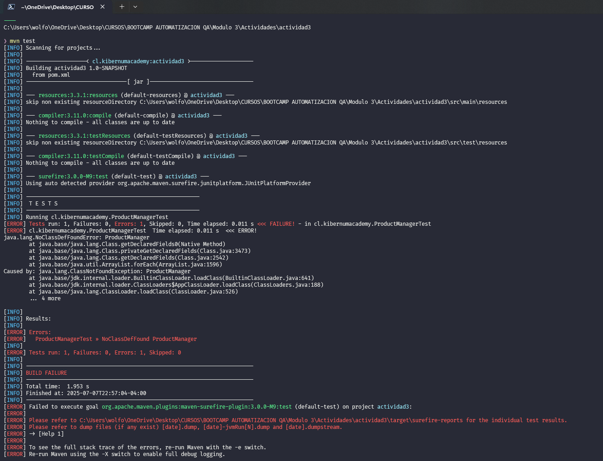
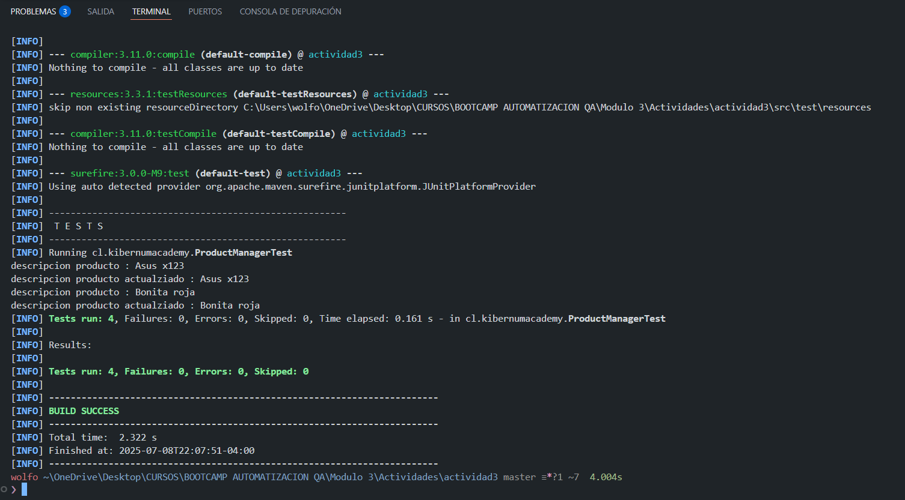
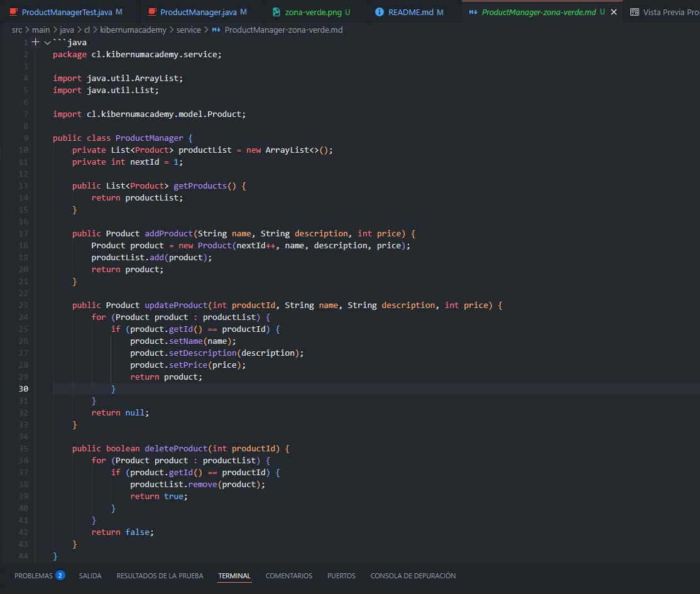
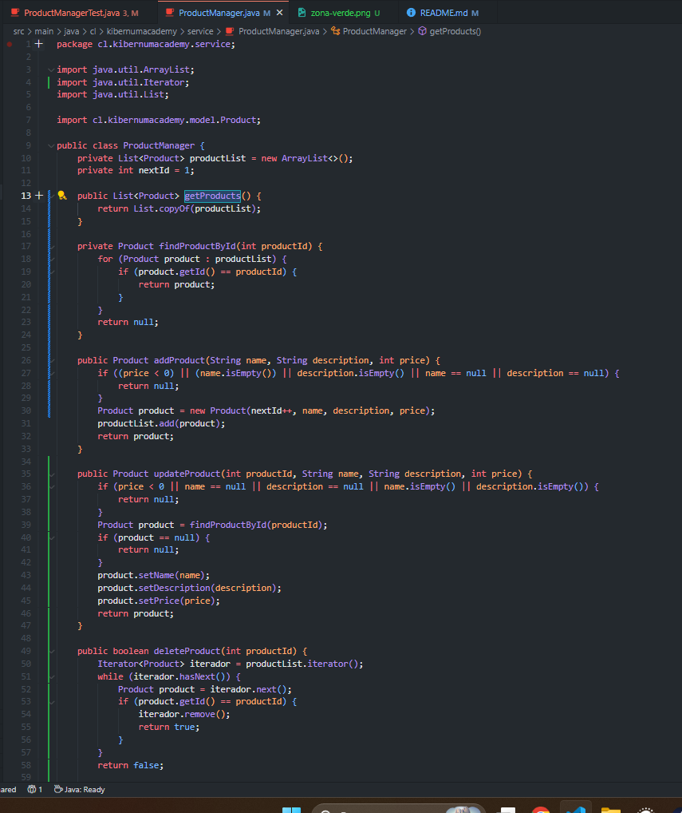

# Sistema de Gestión de Productos con TDD

### Módulo 3 - Sesión 3 - Actividad 3

### Equipo 4: 
- Felipe Lobos
- Fabiola Díaz
- Eduardo Arellano
- Carlos Vasquez
## Gestor de Productos con JUnit 
[!CAUTION]
### RED
Test en zona roja

### GREEN
tests en zona verde

Código fuente en zona verde

### REFACTOR
tests

código refactorizado

